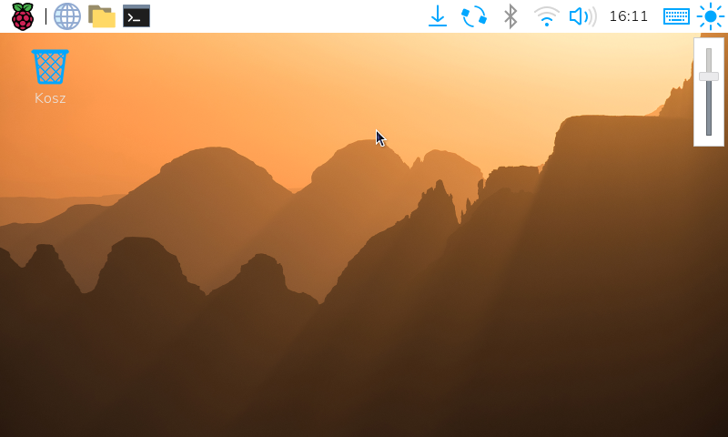

# Backlight plugin for wf-panel-pi

A [wf-panel-pi](https://github.com/raspberrypi-ui/wf-panel-pi) plugin that adds a backlight brightness control to the panel.



Tested with Raspberry Pi Touch Display.

## Building

Requires `gtkmm-3.0` (>= 3.24) and `wf-panel-pi` development headers.

```bash
meson setup builddir --prefix=/usr --libdir=/usr/lib/aarch64-linux-gnu
meson compile -C builddir
sudo meson install -C builddir
```

On a 64-bit system `--libdir=/usr/lib/aarch64-linux-gnu`
On a 32-bit system `--libdir=/usr/lib/arm-linux-gnueabihf`

After installing, add the `backlight` plugin to your panel configuration.

## Generating translations

```bash
meson compile -C builddir wfplug_backlight-pot
meson compile -C builddir wfplug_backlight-update-po
```

